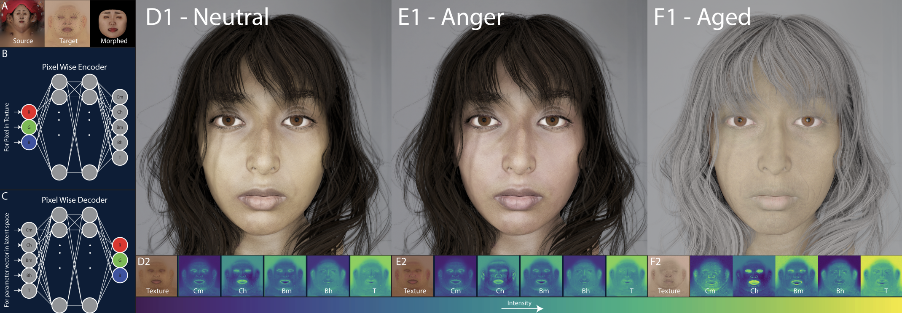
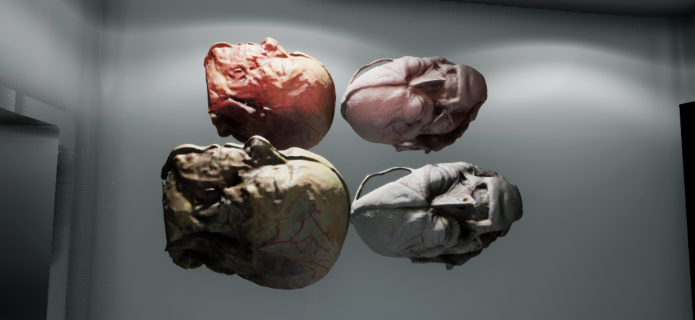

# Abraham Beauferris

Welcome to my portfolio. I am a computer graphics engineer driven by a passion for real-time photorealistic rendering and GPU optimization. My work blends advanced graphics algorithms with cutting-edge AI techniques, and I have been fortunate to contribute to transformational projects at Huawei Canada’s Vancouver Research Center. Here, I push the boundaries of cloud rendering by developing innovative solutions that balance visual fidelity with high-performance execution.

## About Me

I earned First-Class Honours in Computer Science from the University of Calgary, and since then, I have dedicated myself to mastering every facet of graphics programming—from low-level APIs like DirectX, OpenGL, and Vulkan to sophisticated rendering techniques that faithfully capture the nuances of light and material. Whether it’s optimizing real-time pipelines or integrating neural rendering techniques, my approach is rooted in a deep understanding of both theory and practice. I believe in transforming complex concepts into engaging visual experiences that resonate with both technical experts and creative audiences.

## Experience

At Huawei Canada, I joined the Cloud Rendering team with the challenge of elevating our material creation tools and the overall performance of our rendering solutions. I worked in an environment where innovation was not just encouraged but required, as we aimed to integrate advanced ray tracing algorithms and AI-driven techniques into an established engine. Through close collaboration with multidisciplinary teams, I contributed solutions that refined our pipelines, enhanced photorealism, and achieved measurable performance gains—efforts that continue to set new standards in our industry.

Previously, as an Undergraduate Researcher with the Visualization and Graphics Group at the University of Calgary, I was immersed in a project to improve a VR surgical training system. This role demanded a blend of creativity and technical precision as I explored advanced ambient occlusion, subsurface scattering, and dynamic resolution scaling techniques. The improvements I introduced significantly boosted both the immersive quality and interactive responsiveness of the system, directly enhancing its educational impact.

## Projects

### Real-Time Ray Tracer Demo  
_Html5, JavaScript, Canvas API_

In developing the Real-Time Ray Tracer Demo, I set out to reimagine a classic piece of computer graphics—the Utah Teapot—within the modern context of web-based interactivity. I envisioned a project that could not only serve as an educational tool but also demonstrate that high-fidelity, real-time rendering is possible even in the resource-constrained environment of a browser. The project began as a challenge to replicate core ray tracing principles using JavaScript, a language not traditionally associated with heavy computational tasks. To overcome these constraints, I implemented the efficient Möller–Trumbore algorithm for ray–triangle intersection and devised a progressive accumulation strategy. This approach allowed the demo to start with a noisy, approximate image that gradually resolved into a detailed, photorealistic scene as pixel colors were refined over time. The end result is an interactive demonstration that captures the elegance of advanced rendering techniques while highlighting the practical realities of performance optimization in web applications.

### Deep Albedo: A Spatially Aware Autoencoder Approach to Interactive Human Skin Rendering  
_Technologies: C++, Python, OpenCV, UE5_

Deep Albedo represents an ambitious fusion of physics-based rendering and neural network methodologies. Confronted with the intricate problem of simulating human skin, I developed an autoencoder framework that leverages Monte Carlo photon simulations to faithfully capture the interplay of light on skin surfaces. This project required a nuanced understanding of both biophysical properties and computational techniques, and it brought together experts from diverse fields—including collaborators from the University of British Columbia and Huawei Technologies Canada. The resulting system was sophisticated enough to be showcased at SIGGRAPH Asia 2023, and it continues to influence emerging methods in interactive human skin rendering by dynamically adjusting simulated skin tones in response to varying lighting and environmental conditions.

### Enhancing the Graphical Fidelity of the SurgiSim Platform  
_Technologies: Unreal Engine 4, C++_

During my honours research on the SurgiSim VR surgical training platform, the goal was to elevate both its visual realism and interactive performance to meet the rigorous demands of medical training. I was tasked with overcoming the challenges inherent in creating a lifelike virtual environment that responded seamlessly to user interactions. My solution involved integrating advanced techniques—such as directional ambient occlusion to simulate nuanced lighting effects and subsurface scattering to capture the delicate interplay of light beneath surfaces—while also employing dynamic resolution scaling to ensure smooth performance during complex simulations. The transformation of the SurgiSim platform not only resulted in a more immersive training experience but also provided valuable insights into optimizing real-time rendering under demanding conditions.

## Contact Me

I welcome the opportunity to connect with fellow innovators, collaborators, and anyone interested in the evolving landscape of graphics and rendering technology. Whether you want to discuss project ideas, share insights, or explore new collaborative ventures, please reach out.

- **Email:** [abeauferris@gmail.com](mailto:abeauferris@gmail.com)
- **Phone:** 403.874.8433  
- **LinkedIn:** [linkedin.com/in/abrahambeauferris](https://linkedin.com/in/abrahambeauferris)
- **GitHub:** [github.com/abrahambeauferris](https://github.com/abrahambeauferris)

Thank you for visiting my portfolio.