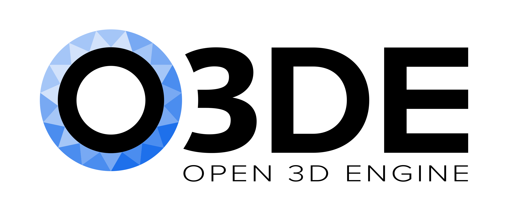

# Abraham Beauferris

Welcome to my portfolio! I am a computer graphics engineer with a passion for rendering algorithms, real-time photorealism, and GPU optimization. I specialize in creating high-performance graphics systems using DirectX, OpenGL, Vulkan, and C++. Currently, I work at Huawei Canada’s Vancouver Research Center, where I focus on pushing the boundaries of cloud rendering and real-time graphics.

Explore my work, research, and career journey below.

---

## Fun Interactive Demo - Stanford Teapot Ray Tracer

This demo renders the famous **Stanford Teapot** using a ray-tracing algorithm implemented in JavaScript. This demo shows the fundamentals of ray tracing with a triangle mesh object!

  <canvas id="raytracer" width="400" height="300" style="border:1px solid #000000;"></canvas>

---

## About Me

I'm Abraham Beauferris, a Computer Science graduate with First-Class Honours from the University of Calgary. My work spans across computer graphics, neural rendering, and GPU optimization. I thrive on challenges that involve physically-based rendering, path tracing, and integrating AI algorithms into game and simulation engines.

When I’m not working on cutting-edge rendering systems, I enjoy contributing to open-source projects, engaging with research communities, and collaborating with other professionals in the field.

### Key Skills
- **Graphics Algorithms**: Advanced knowledge in rendering algorithms and photorealistic rendering systems.
- **APIs**: Extensive experience with DirectX, OpenGL, Vulkan for low-level graphics programming.
- **Rendering Pipelines**: Expertise in path tracing, rasterization, and subsurface scattering.
- **Optimization**: Skilled in GPU performance optimization for real-time applications.
- **AI & Neural Rendering**: Incorporating AI-based techniques using PyTorch and Tensorflow for rendering systems.
- **Programming Languages**: Proficient in C++, Python, and shader programming.

---

## Experience

### Associate Engineer | Huawei Canada, Vancouver Research Center  
_August 2022 - Present_

At Huawei, I contribute to the Cloud Rendering team where I work on advancing real-time photorealistic imagery. My role includes:
- Developing material creation tools within Open 3D Engine.
- Implementing and optimizing physically-based rendering techniques.
- Working with ray tracing algorithms to enhance game development and rendering efficiency.
- Exploring AI algorithms to improve performance and realism in graphics.

### Undergraduate Researcher | VISAGG, University of Calgary  
_September 2021 - May 2022_

I collaborated on the **SurgiSim** project, a VR platform designed to teach otolaryngology through immersive simulations. I contributed to graphical enhancements and helped improve performance through rendering techniques like directional ambient occlusion.

---

## Projects

### Deep Albedo: A Spatially Aware Autoencoder Approach to Interactive Human Skin Rendering  
_C++, Python, OpenCV, UE5_

This research project focused on using **Monte Carlo photon simulations** and **neural autoencoders** to simulate human skin color in real-time. The goal was to create a model that could dynamically change based on biophysical parameters. This project was presented at SIGGRAPH Asia 2023.

### Enhancing the Graphical Fidelity of the SurgiSim Platform  
_Unreal Engine 4, C++_

For my honours research, I enhanced the visual fidelity of the SurgiSim VR platform. I implemented **directional ambient occlusion** and **subsurface scattering** to increase realism. Additionally, I improved the performance using **dynamic resolution scaling**, ensuring the system could run smoothly under demanding conditions.

### Real-time Ray Tracer Demo  
_Html5, JavaScript, Canvas API_

This project is a simple real-time ray tracer built in JavaScript and rendered onto an HTML5 canvas. It demonstrates fundamental ray tracing principles, including ray-sphere intersection. The current scene consists of a ray-traced red sphere on a sky blue background. I plan to expand this demo with more complex objects, lighting, and a fun self-portrait model.

[Try the interactive demo above](#fun-interactive-demo-simple-ray-tracer).

Key Features:
- Ray-sphere intersection
- Basic color rendering
- Expandable to include more features such as lighting, shadows, and multiple objects

---

## Contact Me

I’m always open to new opportunities and collaborations. Feel free to reach out!

- **Email**: [abeauferris@gmail.com](mailto:abeauferris@gmail.com)  
- **Phone**: 403.874.8433  
- **LinkedIn**: [linkedin.com/in/abrahambeauferris](https://linkedin.com/in/abrahambeauferris)  
- **GitHub**: [github.com/abrahambeauferris](https://github.com/abrahambeauferris)

---

Thanks for visiting my portfolio!